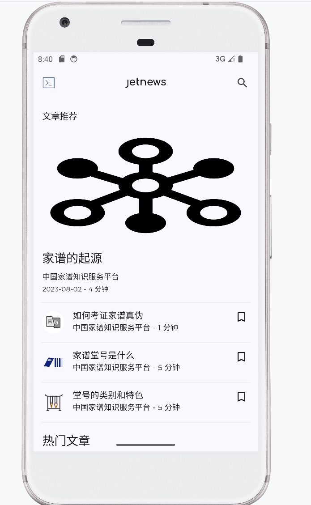

中华家谱APP：记录中国宗族族谱信息的移动应用程序。

 **参考资料** 
- [中国家谱知识服务平台](https://jiapu.library.sh.cn/#/)
- [Android官方文档](https://developer.android.google.cn/reference/)
- [Kotlin语言文档](https://book.kotlincn.net/text/getting-started.html)
- [Material Design指南](https://m2.material.io/guidelines/)
- [GitHub项目模版：JetNews](https://github.com/android/compose-samples/blob/main/JetNews/)

---
 **应用场景** 

目标用户：希望了解家谱文化的用户、有记录家谱需求的用户、对姓氏历史感兴趣的用户。
用户场景和使用案例：
- 用户浏览家谱知识和姓氏科普文章。
- 用户创建和管理自己的家谱信息。
- 用户搜索特定家谱信息或姓氏文章。
- 用户分享和交流家谱信息。
---
 **系统设计** 

架构风格：

采用MVVM（Model-View-ViewModel）架构，通过ViewModel管理UI数据状态，使用Compose Navigation实现页面导航。

模块职责、接口和交互：
- UI模块：负责界面显示和用户交互。
- ViewModel模块：管理数据和业务逻辑。
- Repository模块：处理数据的获取和存储。
- 网络模块：通过Retrofit获取网络数据。
- 数据库模块：使用Room管理本地数据。
关键技术
- Jetpack Compose：用于构建UI界面。
- ViewModel：管理和保存UI相关的数据。
- LiveData：观察数据的变化，更新UI。
- Room：本地数据库，用于存储和管理用户的家谱信息。
- Retrofit：网络请求库，用于获取家谱和姓氏科普文章。

---

 **界面展示** 




## License

```
Copyright 2021 The Android Open Source Project

Licensed under the Apache License, Version 2.0 (the "License");
you may not use this file except in compliance with the License.
You may obtain a copy of the License at

    https://www.apache.org/licenses/LICENSE-2.0

Unless required by applicable law or agreed to in writing, software
distributed under the License is distributed on an "AS IS" BASIS,
WITHOUT WARRANTIES OR CONDITIONS OF ANY KIND, either express or implied.
See the License for the specific language governing permissions and
limitations under the License.
```
